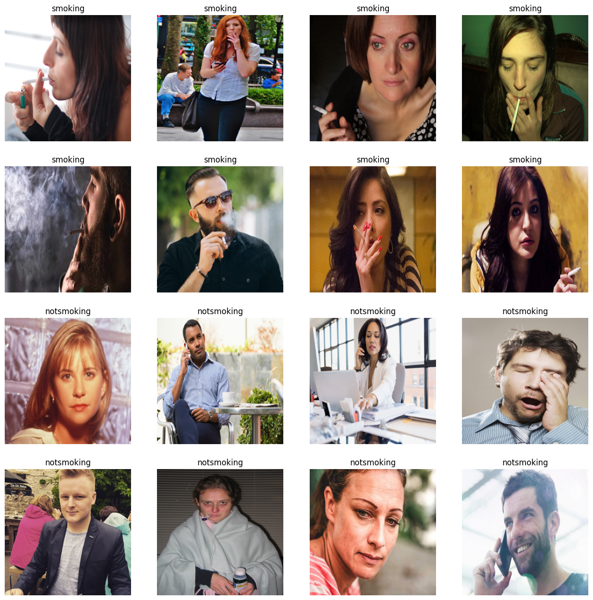
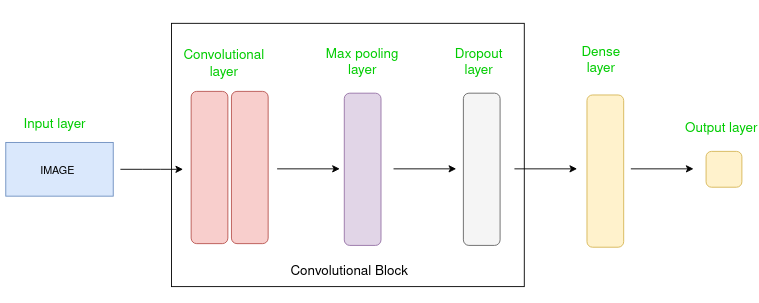
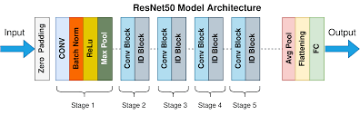
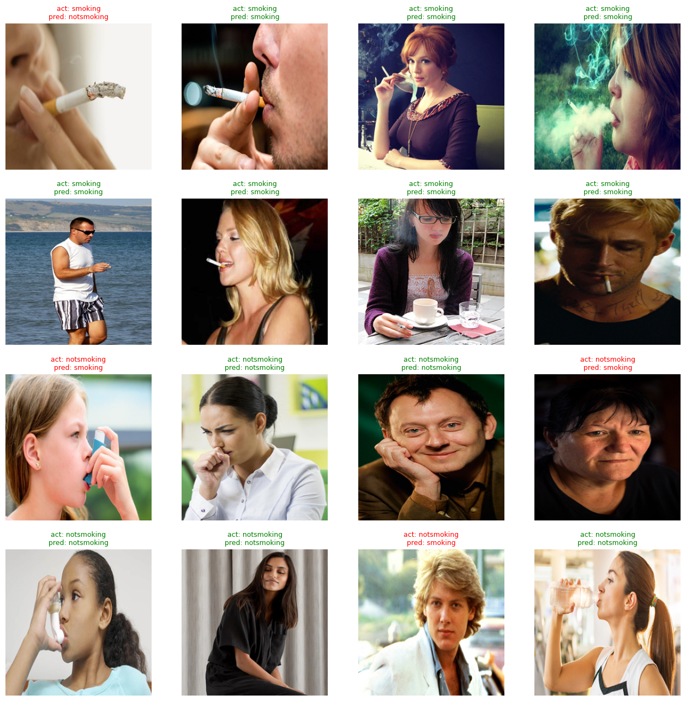

# Image Smoking Detection

## Introduction
Proyek ini bertujuan untuk melakukan deteksi perokok dengan menggunakan *deep learning*. Proyek ini dapat menjadi solusi untuk beberapa tempat yang melarang adanya perokok dikarenakan menganggu kenyamanan serta dampak negatifnya terhadap kesehatan.

Proyek ini menggunakan *computer vision* dan *neural network* untuk dapat memproses gambar - gambar dan mengidentifikasi tiap gambar yang menunjukkan adanya tindakan merokok.

## Related Work
Pada penelitian pertama "CNN-Based Smoker Classification and Detection in Smart City Application" oleh Khan et al. (2022) membahas pengembangan sistem deteksi perokok berbasis kecerdasan buatan untuk pengawasan area tanpa merokok di luar ruangan. Metode yang diusulkan menggunakan transfer learning dengan model InceptionResNetV2, mencapai akurasi sebesar 96.87%. Penelitian ini menggunakan dataset yang sama seperti yang dilakukan pada proyek ini.

Penelitian kedua berjudul "Transfer Learning with ResNet-50 for Malaria Cell-Image Classification" oleh Reddy dan Juliet (2019) membahas penggunaan transfer learning untuk klasifikasi gambar sel malaria. Penelitian ini menyoroti keberhasilan transfer learning tanpa menggunakan perangkat keras modern seperti GPU atau Tensor Processing Unit. Mereka menyarankan penggunaan model lain seperti Google Inception atau Oxford's VGG pada dataset gambar sel malaria untuk meningkatkan akurasi.

Kedua penelitian ini memberikan pandangan yang berharga tentang penggunaan transfer learning dalam konteks deteksi dan klasifikasi gambar, yang dapat membantu memperkaya pendekatan yang digunakan dalam proyek deteksi perokok. Sehingga pada proyek ini juga membandingkan menggunakan transfer learning yaitu model arsitektur ResNet 50.

## Experiments
- ### Dataset

    Dataset ini berisi 1120 gambar yang dibagi secara setara menjadi dua kelas, yaitu 560 gambar dari kelas Smoking (perokok) dan 560 gambar dari kelas NotSmoking (bukan perokok) Khan et al. (2022). Dalam upaya menciptakan tingkat kebingungan antar-kelas yang lebih baik, kelas Smoking dirancang dengan gambar perokok dari berbagai sudut dan gerakan, sementara kelas NotSmoking mencakup gambar orang non-perokok dengan gerakan mirip seperti orang minum air, menggunakan inhaler, memegang ponsel, batuk, dan sebagainya.

- ### Model Neural Network
    #### 1. MLP (3 Hidden Layer):
    Model baseline untuk menangkap pola dasar.

    #### 2. Simple CNN (2 Convolutional Block dan 2 Hidden Layer):
    
    
    CNN digunakan untuk memproses data visual. CNN menggunakan filter untuk mengekstrak fitur penting dari gambar, dengan cara  mengurangi dimensi melalui proses konvolusi dan pooling. CNN memiliki kemampuan untuk memahami fitur secara terstruktur sehingga memungkinkan pengenalan objek dan pola secara efektif pada gambar.

    #### 3. Deep CNN (4 Layer Convolution Block):
    Deep CNN dikembangkan untuk meningkatkan kemampuan model dalam mengekstrak fitur hierarkis yang lebih kompleks.

    #### 4. Transfer Learning ResNet:
    

    Transfer learning dengan ResNet digunakan untuk memanfaatkan pengetahuan yang sudah dipelajari oleh ResNet pada dataset yang lebih besar.

- ### Proses Optimasi Model Neural Network
    - Semua model dioptimalkan menggunakan Adam optimizer dengan parameter default.
    - Augmentasi data dilakukan dengan horizontal flip dan rotasi acak.
    - Fine-tuning dilakukan untuk setiap model dengan memantau akurasi pada data validasi.
    - Evaluasi model menggunakan akurasi dan loss pada data pelatihan dan validasi.

## Result and Discussion
Didapatkan hasil dari pelatihan beberapa jenis model arsitektur adalah sebagai berikut.

| Model          | Train Accuracy | Valid Accuracy | Train Loss | Valid Loss |
|----------------|----------------|----------------|------------|------------|
| MLP            | 70.11%         | 70.56%         | 0.6411     | 0.6419     |
| Simple CNN     | 69.13%         | 72.22%         | 0.6405     | 0.6357     |
| Deep CNN       | 72.21%         | 70.00%         | 0.6306     | 0.6428     |
| ResNet         | 84.22%         | 87.22%         | 0.5790     | 0.5648     |

Sehingga dapat diketahui bahwa semakin kompleks arsitektur model memungkinkan bila hasil deteksi dan prediksi model semakin baik. terlihat bahwa ResNet memiliki train dan valid accuracy tertinggi bila dibandingkan dengan model arsitektur lainnya. hal ini dikarenakan model - model sederhana belum mampu untuk mengekstrak fitur - fitur yang ada pada gambar dikarenakan terlihat jika gambar memiliki berbagai sudut hingga seperti posisi seseorang yang seperti perokok padahal tidak merokok. Berikut merupakan hasil deteksi menggunakan model arsitektur ResNet yang terlihat baik.

## Conclusion
- Model ResNet menjadi model terbaik untuk deteksi perokok dengan akurasi valid sebesar 87.22%

- Transfer Learning menjadi solusi untuk menaikkan performa model dikarenakan memperbanyak pendekatan pada deteksi perokok.

- Dapat dilakukan penelitian menggunakan pendekatan model arsitektur lainnya yang lebh kompleks untuk menaikkan akurasi model deteksi perokok.

## Referensi:
- Khan, A.; Khan, S.; Hassan, B.; Zheng, Z. CNN-Based Smoker Classification and Detection in Smart City Application. Sensors 2022, 22, 892. DOI: 10.3390/s22030892

- Reddy, A. S. B., & Juliet, D. S. (2019). Transfer Learning with ResNet-50 for Malaria Cell-Image Classification. In 2019 International Conference on Communication and Signal Processing (ICCSP), Chennai, India (pp. 0945-0949). DOI: 10.1109/ICCSP.2019.8697909

- https://www.kaggle.com/datasets/sujaykapadnis/smoking/data